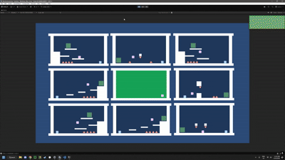
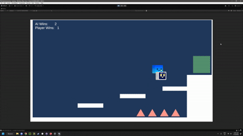
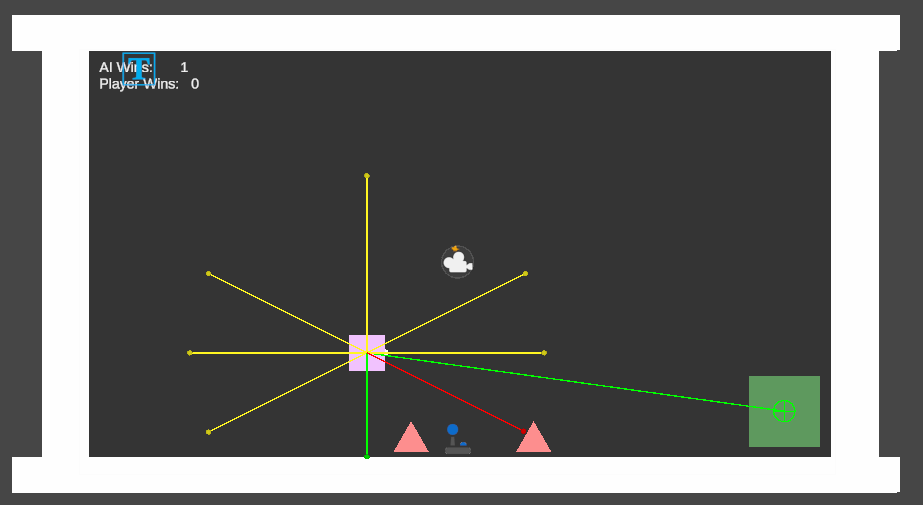
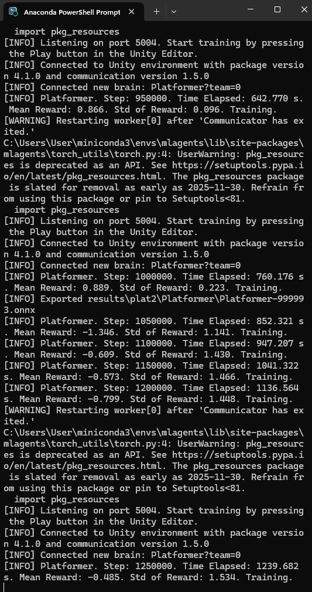
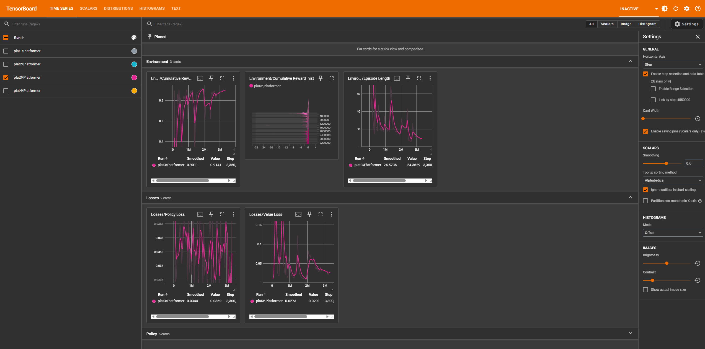
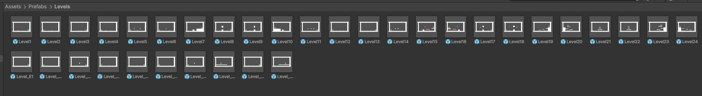
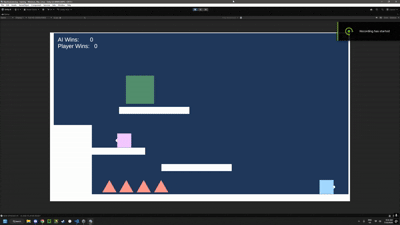

# AI vs Human – Reinforcement Learning
---

## Overview

This project is a 2D platforming game focused on experimenting with reinforcement learning and machine learning using Unity's ML-Agents Toolkit.

The game is an AI vs Human challenge where the player competes against a trained AI agent to see who can reach the goal first. The AI learns how to navigate the platforming environments through trial and error, using rewards and penalties to learn which actions lead to better results.

The project was created as an exploration of reinforcement learning, with a focus on understanding how an AI agent can learn movement, jumping and navigation without being directly programmed with a specific path.

---

## Gameplay

The player and AI compete against each other in a series of platforming rooms.

Each room contains a randomly selected goal that the AI must navigate towards. The AI needs to decide when to move, change direction and jump in order to reach the goal.

The player uses standard platforming controls while the AI uses actions learned through reinforcement learning.

---

## Features

* AI agent trained using reinforcement learning through Unity ML-Agents.

* AI can move left and right and perform jumps to navigate the environment.

* AI learns its behaviour through trial and error rather than being given a predetermined path.

* Multiple training environments can run simultaneously to improve training efficiency.

* Training was performed using multiple AI agents at the same time.

* The game contains approximately 20 - 30 different platforming rooms that can be randomly selected.

* Both the AI and human player compete to reach the goal first.

* Different rooms provide varying levels of difficulty for the AI to navigate.

* Custom UI displays information about the AI's training process, including steps and episodes.

* Training results can be visually monitored through win and loss indicators.

* The AI was progressively trained by starting with simple movement challenges before introducing more complicated platforming environments.

---

## Reinforcement Learning

The main focus of this project was learning how **reinforcement learning** can be used to teach an AI agent to navigate a game environment.

Rather than manually programming the AI to follow a specific route, the agent learns through repeated attempts. The agent receives information about its surroundings through observations and chooses actions based on what it has learned.

The training process involved gradually increasing the difficulty of the environment.

The AI initially learned simple behaviours such as:

* Moving left and right.

* Moving towards a goal.

* Understanding which direction leads towards the goal.

* Combining movement with jumping.

* Navigating increasingly difficult platforming sections.

This gradual progression allowed the AI to develop the basic movement skills before being introduced to more challenging environments.

---

## AI Observations

The agent uses sensors and observations to collect information about the environment.

These observations allow the AI to understand important information about its surroundings and make decisions about which action to take.

The agent's observations are used to determine things such as:

* Its position within the environment.

* The position of the goal.

* Information about the surrounding platforms.

* Whether the agent is grounded.

* Information needed to determine when movement or jumping is appropriate.

---

## AI Actions

The AI has a set of actions that it can choose from during training.

These actions allow the agent to control its character rather than directly controlling its position.

The main actions include:

* Moving left.

* Moving right.

* Jumping.

* Combining movement and jumping to navigate the environment.

The AI learns which actions are most effective based on the rewards it receives during training.

---

## Training

The AI was trained using the Unity ML-Agents Toolkit and Python.

Training was initially performed using simple environments so that the agent could learn basic movement before being introduced to more difficult challenges.

I used multiple copies of the environment so that 9 agents could train simultaneously. This allowed the training process to collect experiences from multiple agents at the same time.

The agent went through multiple training attempts, with the environment and difficulty being adjusted as I learned more about reinforcement learning.

The final training process reached approximately 2 million training steps.

---

## Training Environment

Originally, I planned to create a system that would completely randomly generate each room. However, I found that generating the rooms dynamically made the project significantly more complicated and caused problems with positioning objects correctly.

Instead, I created approximately 20 - 30 different rooms and made the game randomly select one for each round.

This approach provided enough variety for the AI while also allowing the rooms to be properly designed and tested.

It also made the environments suitable for both AI training and the final AI vs Human gameplay.

---

## AI vs Human

The final goal of the project was to create a game where the trained AI could compete directly against a human player.

After training, the AI was able to navigate the platforming environments well enough to compete against me, and eventually began winning the majority of the rounds.

This provided a practical way to demonstrate the result of the reinforcement learning process rather than only showing the AI training by itself.

---

## Training UI

I created a custom UI to monitor the AI while it was training.

The UI displays information such as:

* Current training step.

* Current episode.

* Episode result.

* Win/loss state.

The background also changes colour depending on the result of the episode, making it easier to visually monitor multiple AI agents at once.

---

## Tech Used / Dependencies

* Unity

* C#

* Unity ML-Agents Toolkit

* Python

* Anaconda

* PyTorch

* Unity 2D Physics

* Unity UI / TextMeshPro

---

## Project Goals

The main goal of this project was to learn and experiment with reinforcement learning and understand how an AI agent can learn behaviours through trial and error.

Rather than manually programming the AI's movement, I wanted to create an agent that could observe its environment, choose actions and gradually improve through training.

The AI vs Human gameplay provided a practical way to demonstrate the results of this process. It also allowed me to experiment with different training environments, reward systems, observations and actions to see how they affected the agent's behaviour.

Through this project, I gained a better understanding of how machine learning can be applied to games and the challenges involved in creating an effective reinforcement learning environment.
