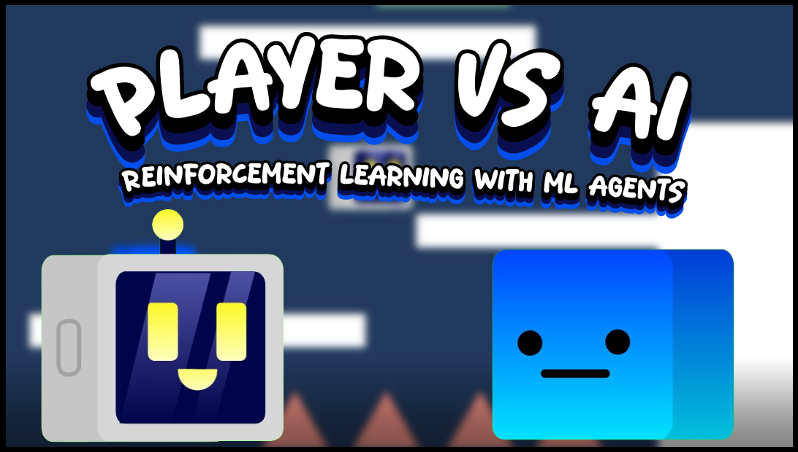

# AI vs Human – Reinforcement Learning

---

## Overview

This project is a 2D platforming game focused on experimenting with reinforcement learning and machine learning using Unity's ML-Agents Toolkit.

The game is an AI vs Human challenge where the player competes against a trained AI agent to see who can reach the goal first. The AI learns how to navigate the platforming environments through trial and error, using rewards and penalties to learn which actions lead to better results.

The project was created as an exploration of reinforcement learning, with a focus on understanding how an AI agent can learn movement, jumping and navigation without being directly programmed with a specific path.

---

## Gameplay

The player and AI compete against each other in a series of platforming rooms.

Each room contains a randomly selected goal that the AI must navigate towards. The AI needs to decide when to move, change direction and jump in order to reach the goal.

The player uses standard platforming controls while the AI uses actions learned through reinforcement learning.

---

## Features

* AI agent trained using reinforcement learning through Unity ML-Agents.

* AI can move left and right and perform jumps to navigate the environment.

* AI learns its behaviour through trial and error rather than being given a predetermined path.

* Multiple training environments can run simultaneously to improve training efficiency.

* Training was performed using multiple AI agents at the same time.

* The game contains approximately 20 - 30 different platforming rooms that can be randomly selected.

* Both the AI and human player compete to reach the goal first.

* Different rooms provide varying levels of difficulty for the AI to navigate.

* Custom UI displays information about the AI's training process, including steps and episodes.

* Training results can be visually monitored through win and loss indicators.

* The AI was progressively trained by starting with simple movement challenges before introducing more complicated platforming environments.

* Player Character Included so you can race the AI agent.

---

## AI Observations

The agent uses sensors and observations to collect information about the environment.

These observations allow the AI to understand important information about its surroundings and make decisions about which action to take.

The agent's observations are used to determine things such as:

* Its position within the environment.

* The position of the goal.

* Information about the surrounding platforms.

* Whether the agent is grounded.

* Information needed to determine when movement or jumping is appropriate.

---

## AI Actions

The AI has a set of actions that it can choose from during training.

These actions allow the agent to control its character rather than directly controlling its position.

These actions include:

* Moving left.

* Moving right.

* Jumping.

The AI learns which actions are most effective based on the rewards it receives during training.

---

## Training

The AI was trained using the Unity ML-Agents Toolkit and Python.

Training was initially performed using simple environments so that the agent could learn basic movement before being introduced to more difficult challenges.

I used multiple copies of the environment so that 9 agents could train simultaneously but this can be easily expanded.

Using multiple agents to train allows the training process to collect experiences from multiple agents at the same time, and speeds up training process.

The final training process used in the current build reached approximately 2 million training steps.

---

## Tech Used / Dependencies

* Unity Hub

* Unity

* Visual Studio or Visual Studio Code

* Unity ML-Agents Toolkit

* Python

* Anaconda

* PyTorch

---
